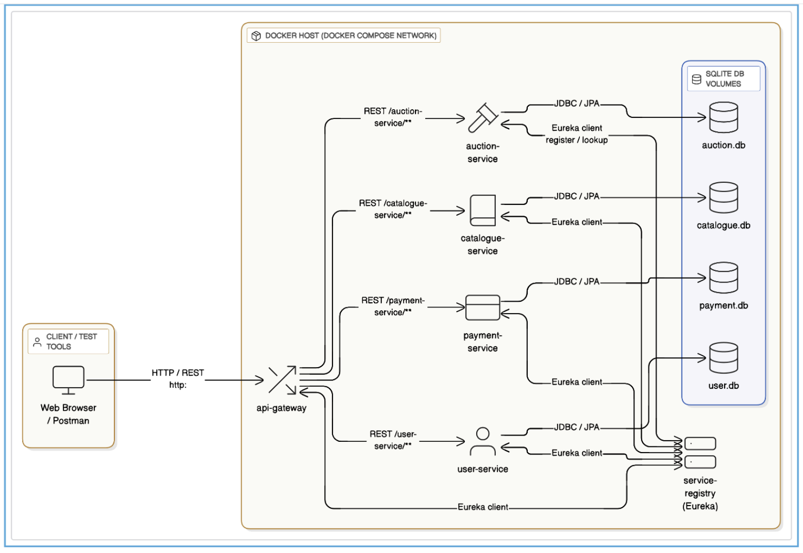
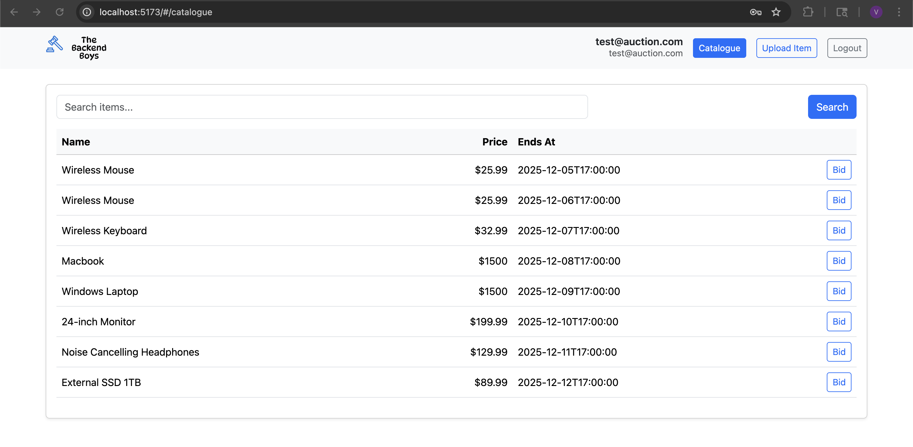
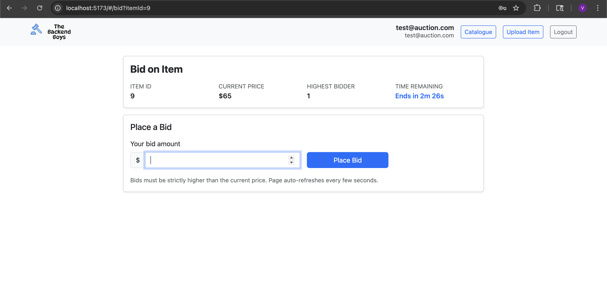
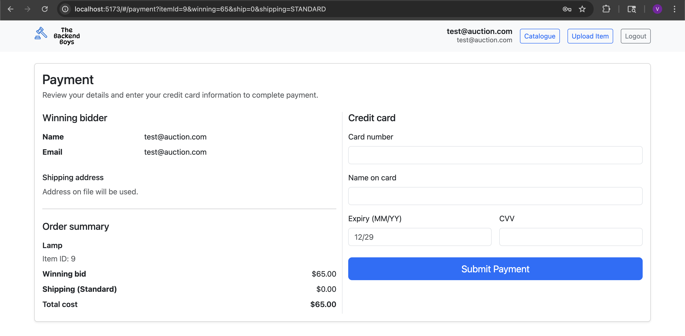
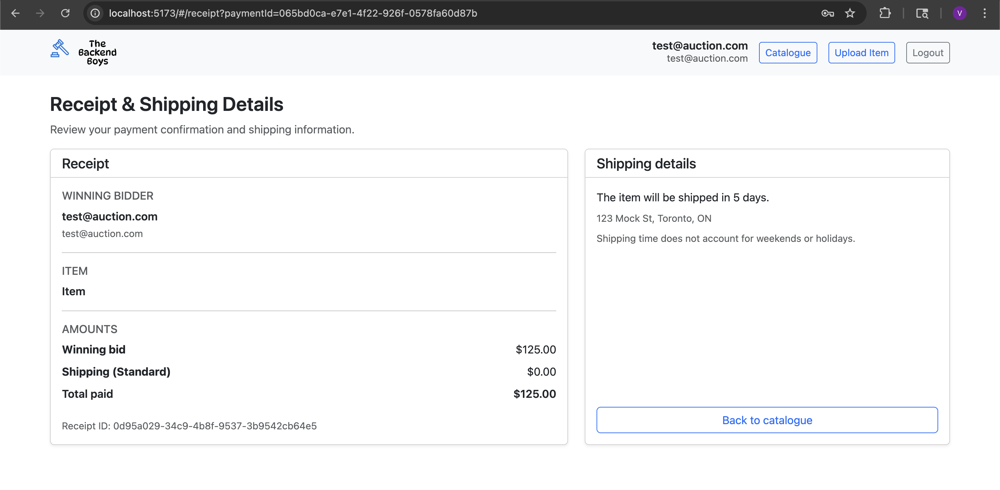
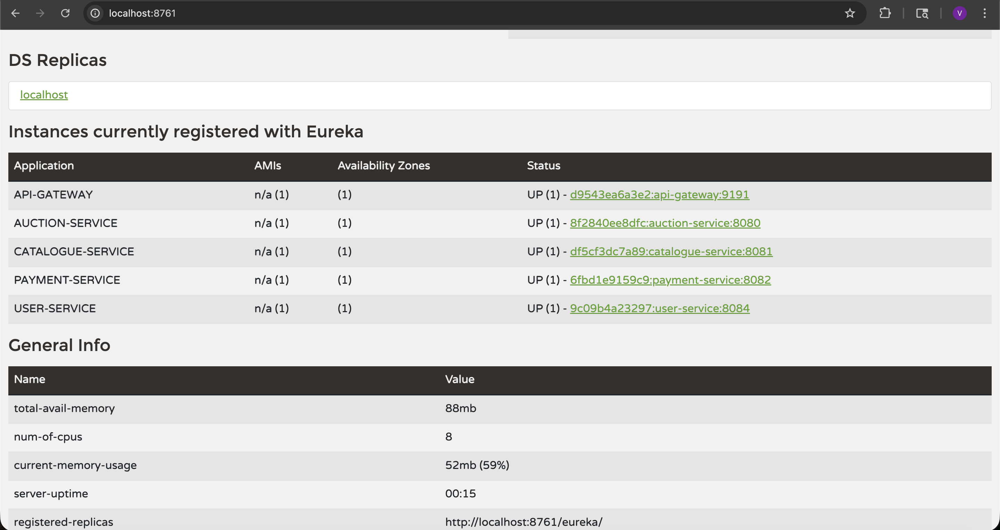

# AuctionHouse — Microservices Auction Platform


A full-stack real-time auction platform built with a **Spring Boot microservices backend** and a **React + Vite frontend**. Six independently deployable services communicate through an API Gateway backed by Netflix Eureka service discovery. The system handles concurrent bidding with optimistic locking, auto-closes expired auctions on a background scheduler, and processes payments with receipt generation.

---

## Table of Contents

- [Features](#features)
- [Architecture](#architecture)
- [Tech Stack](#tech-stack)
- [Services](#services)
- [API Reference](#api-reference)
- [Getting Started](#getting-started)
- [Project Structure](#project-structure)
- [Screenshots](#screenshots)
- [Design Patterns](#design-patterns)

---

## Features

- **Live bidding** — bid page polls auction state every 5 seconds with a live countdown timer
- **Concurrent bid safety** — `@Version`-based optimistic locking prevents race conditions when multiple users bid simultaneously
- **Automatic auction closing** — background scheduler polls every 30 seconds and closes expired auctions
- **Full payment flow** — winners pay, select shipping tier, and receive a generated receipt
- **Keyword search** — catalogue service supports case-insensitive search across item name and keyword tags
- **Service discovery** — all services self-register with Eureka; the gateway routes by service ID with no hardcoded URLs
- **Single entry point** — all traffic (API and frontend) flows through one gateway on port 9191
- **Containerized** — full stack runs with a single `docker compose up`

---

## Architecture



```
                        ┌─────────────────────────────────┐
                        │         Browser / Client         │
                        └────────────────┬────────────────┘
                                         │ HTTP :9191
                        ┌────────────────▼────────────────┐
                        │           API Gateway            │
                        │     (Spring Cloud Gateway)       │
                        │   Serves React SPA + routes API  │
                        └──┬──────┬──────┬──────┬─────────┘
                           │      │      │      │
              ┌────────────▼─┐ ┌──▼───┐ ┌▼────┐ ┌▼──────────────┐
              │    Auction   │ │ Cat. │ │User │ │   Payment     │
              │   Service   │ │ Svc  │ │ Svc │ │   Service     │
              │   :8080     │ │:8081 │ │:8084│ │    :8082      │
              └──────┬───────┘ └──┬───┘ └──┬──┘ └───────┬───────┘
                     │            │         │             │
              ┌──────▼────────────▼─────────▼─────────────▼───────┐
              │              Netflix Eureka Registry               │
              │                    :8761                           │
              └────────────────────────────────────────────────────┘

  Each service owns its own SQLite database (no shared data stores).
  The gateway discovers service locations from Eureka — no hardcoded URLs.
```

### Request Flow Example

```
Browser → GET /catalogue-service/catalogue/search?q=laptop
               ↓
         API Gateway  (resolves "catalogue-service" via Eureka)
               ↓
         Catalogue Service  →  catalogue.db
               ↓
         JSON response back through gateway to browser
```

---

## Tech Stack

### Backend

| Layer             | Technology                                |
| ----------------- | ----------------------------------------- |
| Language          | Java 17                                   |
| Framework         | Spring Boot 3.5.8                         |
| Service mesh      | Spring Cloud 2025.0.0                     |
| API Gateway       | Spring Cloud Gateway (WebFlux / reactive) |
| Service discovery | Netflix Eureka                            |
| ORM               | Spring Data JPA + Hibernate 6             |
| Database          | SQLite 3.46 (one DB file per service)     |
| Build tool        | Apache Maven (multi-module)               |
| Containerization  | Docker + Docker Compose                   |

### Frontend

| Layer      | Technology                       |
| ---------- | -------------------------------- |
| Framework  | React 18                         |
| Build tool | Vite 5                           |
| Routing    | React Router 6                   |
| Styling    | Bootstrap 5                      |
| State      | React Context API + localStorage |

---

## Services

| Service             | Port | Responsibility                                                                                                                   |
| ------------------- | ---- | -------------------------------------------------------------------------------------------------------------------------------- |
| `service-registry`  | 8761 | Netflix Eureka server — all services register and discover each other here                                                       |
| `api-gateway`       | 9191 | Single entry point — serves the React SPA and reverse-proxies API calls by Eureka service ID                                     |
| `auction-service`   | 8080 | Auction lifecycle: create, bid, close. CQRS split into command/query services. Background scheduler auto-closes expired auctions |
| `catalogue-service` | 8081 | Item catalog: CRUD, keyword search, shipping cost lookup                                                                         |
| `user-service`      | 8084 | User registration, login, password reset                                                                                         |
| `payment-service`   | 8082 | Payment processing and receipt generation for auction winners                                                                    |

---

## API Reference

All endpoints are accessed through the gateway at `http://localhost:9191`.

### Auction Service — `/auction-service/auctions`

| Method | Path                         | Description                                                                 |
| ------ | ---------------------------- | --------------------------------------------------------------------------- |
| `POST` | `/auctions`                  | Create auction `{ itemId, startPrice, endsAt, sellerId }`                   |
| `GET`  | `/auctions/{itemId}`         | Current auction state + bid status                                          |
| `POST` | `/auctions/{itemId}/bid`     | Place a bid `{ bidderId, amount }` — must be a whole integer > currentPrice |
| `GET`  | `/auctions/{itemId}/history` | Ordered bid history for an item                                             |
| `POST` | `/auctions/{itemId}/close`   | Manually close an auction                                                   |

### Catalogue Service — `/catalogue-service/catalogue`

| Method  | Path                            | Description                                    |
| ------- | ------------------------------- | ---------------------------------------------- |
| `POST`  | `/catalogue`                    | Create a new item listing                      |
| `GET`   | `/catalogue/items/active`       | List all active items                          |
| `GET`   | `/catalogue/search?q={keyword}` | Case-insensitive search by name or keyword tag |
| `GET`   | `/catalogue/{id}`               | Get item details                               |
| `GET`   | `/catalogue/{id}/shipping`      | Standard and expedited shipping costs          |
| `PATCH` | `/catalogue/{id}/status`        | Update item status (ACTIVE / SOLD / INACTIVE)  |

### User Service — `/user-service`

| Method | Path                   | Description                                                     |
| ------ | ---------------------- | --------------------------------------------------------------- |
| `POST` | `/auth/register`       | Register — requires username, email, password, and full address |
| `POST` | `/auth/login`          | Login with email + password                                     |
| `POST` | `/auth/reset-password` | Reset password by email                                         |
| `GET`  | `/users`               | List all users                                                  |

### Payment Service — `/payment-service`

| Method | Path                    | Description                                                                             |
| ------ | ----------------------- | --------------------------------------------------------------------------------------- |
| `POST` | `/payments`             | Create payment `{ itemId, userId, shippingChoice, cardNumber, cardName, cardExp, cvv }` |
| `GET`  | `/payments/{paymentId}` | Payment details                                                                         |
| `GET`  | `/receipts/{paymentId}` | Generated receipt for a completed payment                                               |

---

## Getting Started

### Prerequisites

- [Docker Desktop](https://www.docker.com/products/docker-desktop/) — recommended for running the full stack
- Or: Java 17+, Maven 3.9+, Node.js 20+

---

### Option 1 — Docker Compose (Recommended)

The React frontend must be built before the Maven package step — the Vite build outputs into `api-gateway/src/main/resources/static/`, which gets bundled into the gateway JAR.

```bash
# 1. Clone the repository
git clone https://github.com/<your-username>/eecs4413-microservices-auction-project.git
cd eecs4413-microservices-auction-project

# 2. Build the React frontend
cd frontend
npm ci
npm run build
cd ..

# 3. Package all Spring Boot JARs
mvn clean package -DskipTests

# 4. Build Docker images and start all 6 containers
docker compose build
docker compose up
```

| URL                     | What you get                                           |
| ----------------------- | ------------------------------------------------------ |
| `http://localhost:9191` | React frontend (auction app)                           |
| `http://localhost:8761` | Eureka dashboard — confirm all services are registered |

To run in the background: `docker compose up -d`
To stop and remove: `docker compose down`

---

### Option 2 — Local Maven (Development)

Start services in this order — `service-registry` must be running before any other service attempts to register.

```bash
# Terminal 1
cd service-registry && ./mvnw spring-boot:run

# Terminal 2 (after registry is up)
cd api-gateway && ./mvnw spring-boot:run

# Terminals 3–6 (any order)
cd auction-service   && ./mvnw spring-boot:run
cd catalogue-service && ./mvnw spring-boot:run
cd user-service      && ./mvnw spring-boot:run
cd payment-service   && ./mvnw spring-boot:run

# Frontend dev server with hot reload (proxies API calls to localhost:9191)
cd frontend && npm run dev
```

---

### Postman Collection

Import `PostmanTestCases/GatewayRoutes.postman_collection.json` and set the base URL variable to `http://localhost:9191`.

---

## Project Structure

```
eecs4413-microservices-auction-project/
├── docker-compose.yml
├── pom.xml                               # Parent Maven POM (multi-module)
│
├── service-registry/                     # Netflix Eureka server
│
├── api-gateway/                          # Spring Cloud Gateway + React SPA host
│   └── src/main/resources/
│       ├── static/                       # Vite build output (generated — do not edit)
│       ├── application.properties        # Local profile
│       └── application-docker.properties # Docker profile
│
├── auction-service/
│   └── src/main/java/.../
│       ├── controller/AuctionController.java
│       ├── service/
│       │   ├── AuctionCommandService.java    # writes: bid, create, close
│       │   └── AuctionQueryService.java      # reads: state, history
│       ├── scheduler/AuctionClosingScheduler.java
│       └── model/Auction.java                # @Version optimistic locking
│
├── catalogue-service/
│   └── src/main/java/.../
│       ├── controller/CatalogueController.java
│       └── service/CatalogueService.java
│
├── user-service/
│   └── src/main/java/.../
│       ├── controller/UserController.java
│       └── service/UserService.java
│
├── payment-service/
│   └── src/main/java/.../
│       ├── controller/PaymentController.java
│       └── service/PaymentServiceImpl.java
│
├── frontend/                             # React + Vite SPA
│   ├── vite.config.js
│   └── src/
│       ├── App.jsx                       # Route definitions
│       ├── context/AuthContext.jsx       # Global auth state
│       ├── services/api.js               # All API calls — single source of truth
│       └── pages/
│           ├── LoginPage.jsx
│           ├── SignupPage.jsx
│           ├── ForgotPasswordPage.jsx
│           ├── CataloguePage.jsx
│           ├── BidPage.jsx               # Live polling + countdown timer
│           ├── UploadItemPage.jsx
│           ├── PayPage.jsx
│           ├── PaymentPage.jsx
│           └── ReceiptPage.jsx
│
└── PostmanTestCases/
    └── GatewayRoutes.postman_collection.json
```

---

## Screenshots

### Catalogue — Browse & Search Items



### Bid Page — Live Auction with Countdown Timer



### Payment Flow



### Receipt



### Eureka Dashboard — All 4 Services Registered



---

## Design Patterns

### CQRS (Command Query Responsibility Segregation)

`auction-service` is split into `AuctionCommandService` (writes: place bid, create, close) and `AuctionQueryService` (reads: state, history). Mutation logic is isolated from the read path, and each can be tuned independently.

### Optimistic Locking

`Auction` carries a `@Version Long version` field managed by Hibernate. When two users submit a bid at the same instant, only one write succeeds — the other triggers an `ObjectOptimisticLockingFailureException`, caught by the command service and surfaced as a conflict response. No pessimistic locks, no deadlocks.

### Scheduled Background Job

`AuctionClosingScheduler` runs `@Scheduled(fixedDelay = 30_000)`, queries for all `OPEN` auctions whose `endTime` has passed, and transitions them to `ENDED`. Closing is fully decoupled from the bid request path.

### API Gateway + Service Discovery

The gateway uses Spring Cloud's Eureka discovery locator — routes are derived automatically from the service IDs registered in Eureka. Adding a new service requires zero changes to the gateway configuration.

### Database-per-Service

Each service owns its own SQLite file (`auction.db`, `catalogue.db`, `payment.db`, `user.db`). There are no cross-service JOINs or shared schemas — service boundaries are enforced at the data layer, not just the API layer.

---

## License

Built for academic purposes. Not licensed for commercial use.
